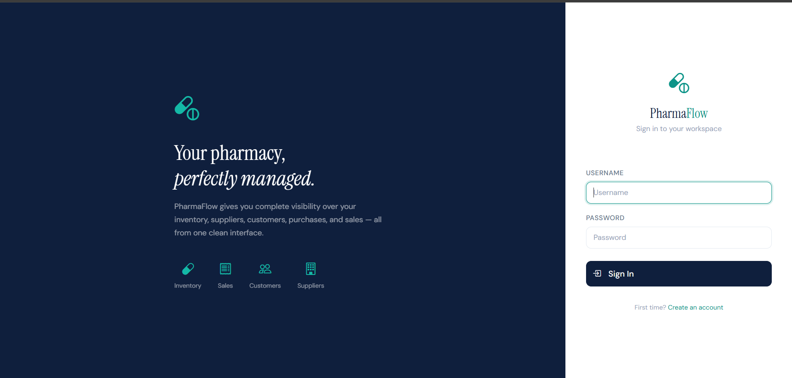
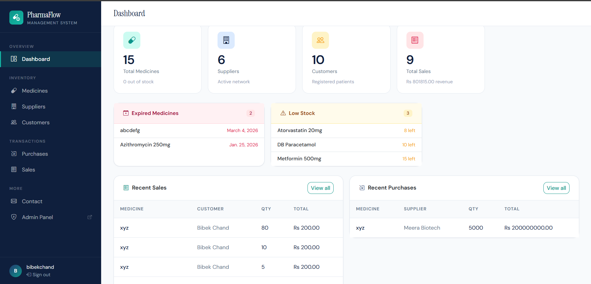
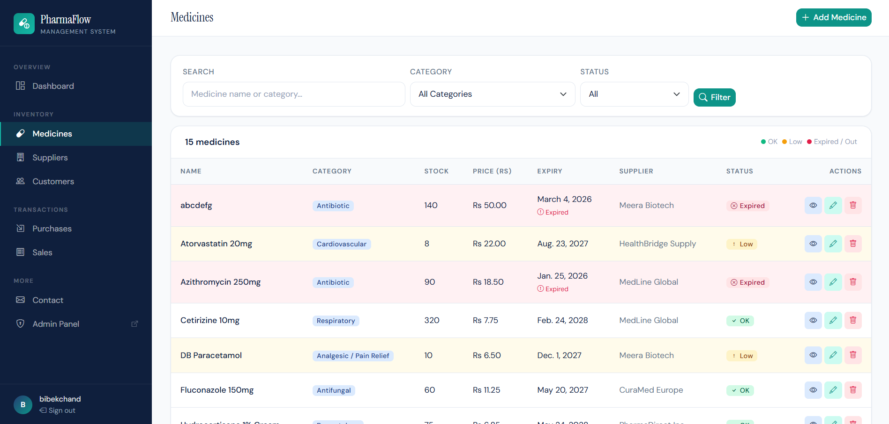
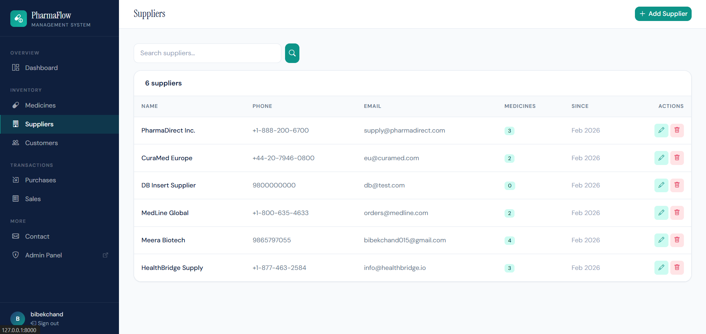
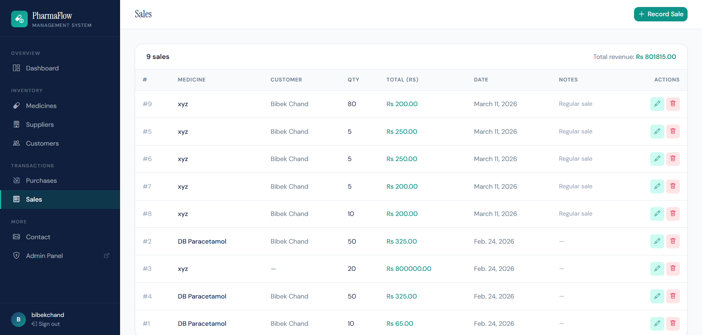
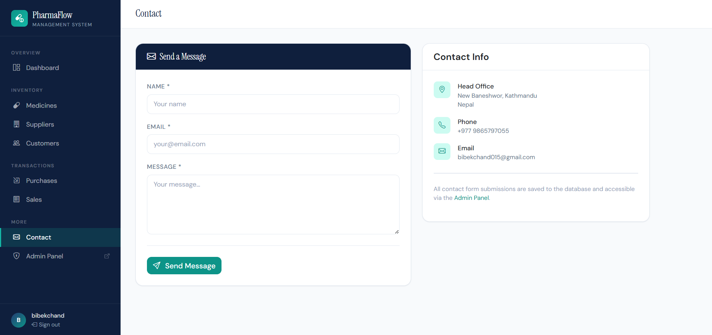

# 💊 PharmaFlow - Pharmacy Management System

A complete pharmacy inventory and transaction management web application built with Django and PostgreSQL.

---

## 🧭 Project Map

- [🌟 Overview](#-overview)
- [🎯 Problem & Solution](#-problem--solution)
- [4.1 Project Description](#41-project-description)
- [4.2 Technology Stack](#42-technology-stack)
- [📋 Prerequisites](#-prerequisites)
- [4.3 Installation Instructions](#43-installation-instructions)
- [4.4 Features Implemented](#44-features-implemented)
- [5. Project Manual](#5-project-manual)
- [🖼️ Frontend Showcase](#️-frontend-showcase)
- [📁 Project Structure](#-project-structure)

---

## 🌟 Overview

PharmaFlow is designed to manage daily pharmacy operations from one dashboard. It supports medicine inventory tracking, supplier/customer management, purchase and sales transactions, and contact message handling.

The project focuses on practical business flow: update stock through purchases and sales, monitor low/expired medicines, and keep records organized with easy CRUD operations.

---

## 🎯 Problem & Solution

| Challenge | Solution in PharmaFlow |
|---|---|
| Manual medicine and stock tracking | Centralized medicine inventory with automatic stock updates |
| Difficulty monitoring expired/low stock items | Dashboard alerts and status indicators for inventory health |
| Scattered supplier and customer records | Dedicated supplier and customer management modules |
| Error-prone sales/purchase records | Validated forms with save/edit/delete flows and stock-safe logic |

---

## 4.1 Project Description

### Overview of the application
PharmaFlow is a Django-based pharmacy management system that enables authenticated users to manage medicines, suppliers, customers, purchases, and sales through a clean web interface.

### Problem being solved
The application reduces manual record-keeping and improves operational accuracy by digitizing core pharmacy workflows such as stock-in, stock-out, and record maintenance.

### Key features
- User authentication (register, login, logout)
- Protected routes for authenticated users
- Dashboard with KPI cards and recent activity
- Medicine CRUD operations
- Supplier CRUD operations
- Customer CRUD operations
- Purchase CRUD operations (with stock increase)
- Sale CRUD operations (with stock decrease and validation)
- Contact submission form saved to database

---

## 4.2 Technology Stack

### Backend
- Django 5
- Python 3
- PostgreSQL
- Django ORM

### Frontend
- Django Templates
- HTML5
- CSS3
- JavaScript
- Bootstrap 5 + Bootstrap Icons

### Deployment/Serving
- Gunicorn
- WhiteNoise

---

## 📋 Prerequisites

Before running the project, install:

- Python 3.10+
- PostgreSQL
- Git
- pip (Python package manager)

---

## 4.3 Installation Instructions

### 1) Clone repository
```bash
git clone https://github.com/B-chand/pharmacy_web.git
cd pharmacy_web
```

### 2) Create virtual environment
```bash
python -m venv venv
```

### 3) Activate virtual environment
Windows:
```bash
venv\Scripts\activate
```

macOS/Linux:
```bash
source venv/bin/activate
```

### 4) Install dependencies
```bash
pip install -r requirements.txt
```

### 5) Configure environment variables
Create `.env` file in project root:

```env
SECRET_KEY=your_secret_key
DEBUG=True

DB_NAME=medicinedbfile
DB_USER=postgres
DB_PASSWORD=your_password
DB_HOST=localhost
DB_PORT=5000
```

### 6) Create PostgreSQL database
Create a database named `pharmaflow_db`.

### 7) Run migrations
```bash
python manage.py makemigrations
python manage.py migrate
```

### 8) (Optional) Create superuser
```bash
python manage.py createsuperuser
```

### 9) (Optional) Seed initial data
```bash
python manage.py seed
```

### 10) Start development server
```bash
python manage.py runserver
```

Open: `http://127.0.0.1:8000/`

---

## 4.4 Features Implemented

- Authentication: register, login, logout
- Route protection with `login_required`
- Dashboard with total counts and activity overview
- Medicines: add, list, detail, edit, delete
- Suppliers: add, list, edit, delete
- Customers: add, list, edit, delete
- Purchases: add, list, edit, delete
- Sales: add, list, edit, delete
- Auto stock adjustment on purchase/sale create/edit/delete
- Sales validation against available stock
- Search and filtering in management pages
- Contact page with database persistence
- Django admin integration

---

## 5. Project Manual

### Step-by-step explanation of system flow

1. User opens the login page and signs in.
2. System verifies credentials and redirects to Dashboard.
3. Dashboard displays inventory and transaction summary.
4. User manages medicines (create/read/update/delete).
5. User manages suppliers and customers.
6. User records purchases; medicine stock is automatically increased.
7. User records sales; medicine stock is automatically decreased.
8. User edits/deletes purchases or sales; stock is recalculated safely.
9. User submits contact form; message is stored in database.
10. Admin can review and manage all entities via Django admin panel.

### Screenshots of important pages

Important UI screens are included in the `ui/` folder and shown below.

---

## 🖼️ Frontend Showcase

| Stage | Preview |
|---|---|
| 🚀 Sign In Page |  |
| 🚀 Dashboard |  |
| 🚀 Medicines |  |
| 🚀 Suppliers |  |
| 🚀 Sales |  |
| 🚀 Contact |  |

---

## 📁 Project Structure

```text
pharmacy_web/
├── manage.py
├── requirements.txt
├── README.md
├── .env.example
├── ui/
│   ├── signin_page.png
│   ├── dashboard.png
│   ├── medicine.png
│   ├── supplier.png
│   ├── sales.png
│   └── contact.png
├── pharmaflow/
│   ├── __init__.py
│   ├── settings.py
│   ├── urls.py
│   └── wsgi.py
└── pharmacy/
	├── __init__.py
	├── admin.py
	├── apps.py
	├── forms.py
	├── models.py
	├── urls.py
	├── views.py
	├── migrations/
	├── management/
	│   └── commands/
	│       └── seed.py
	├── static/
	│   └── pharmacy/
	│       ├── css/
	│       └── js/
	└── templates/
		└── pharmacy/
```

---


